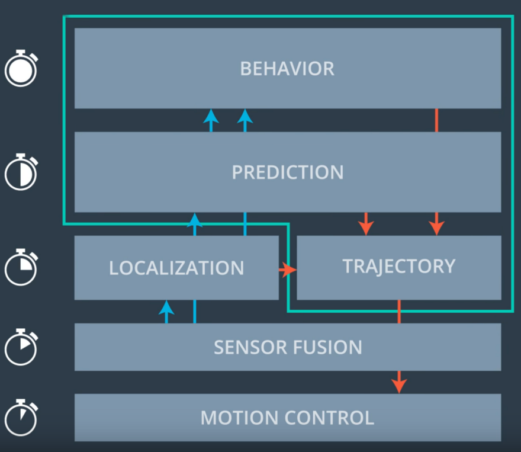
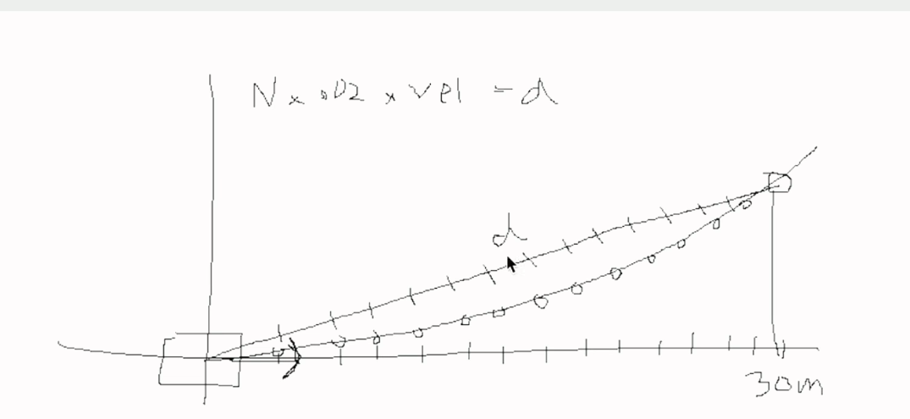
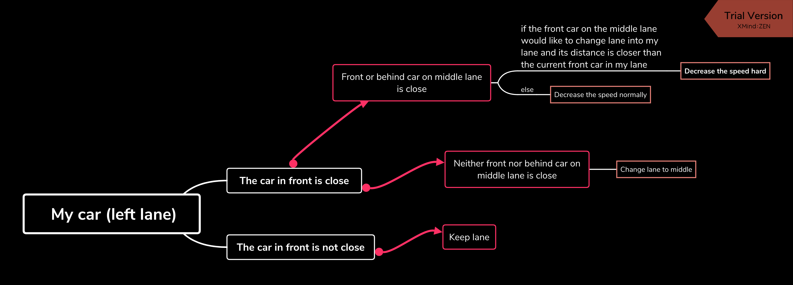
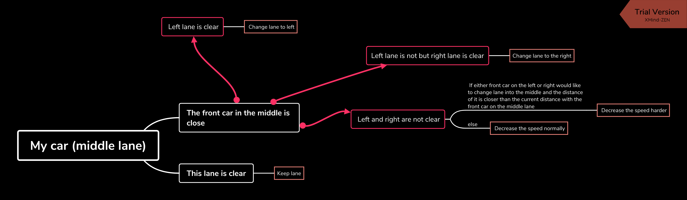

# My solution for CarND-Path-Planning-Project
---
[](http://www.udacity.com/drive)

   
### Simulator.
You can download the Term3 Simulator which contains the Path Planning Project from the [releases tab (https://github.com/udacity/self-driving-car-sim/releases/tag/T3_v1.2).  

To run the simulator on Mac/Linux, first make the binary file executable with the following command:
```shell
sudo chmod u+x {simulator_file_name}
```

### Goals
In this project your goal is to safely navigate around a virtual highway with other traffic that is driving +-10 MPH of the 50 MPH speed limit. You will be provided the car's localization and sensor fusion data, there is also a sparse map list of waypoints around the highway. The car should try to go as close as possible to the 50 MPH speed limit, which means passing slower traffic when possible, note that other cars will try to change lanes too. The car should avoid hitting other cars at all cost as well as driving inside of the marked road lanes at all times, unless going from one lane to another. The car should be able to make one complete loop around the 6946m highway. Since the car is trying to go 50 MPH, it should take a little over 5 minutes to complete 1 loop. Also the car should not experience total acceleration over 10 m/s^2 and jerk that is greater than 10 m/s^3.

#### The map of the highway is in data/highway_map.txt
Each waypoint in the list contains  [x,y,s,dx,dy] values. x and y are the waypoint's map coordinate position, the s value is the distance along the road to get to that waypoint in meters, the dx and dy values define the unit normal vector pointing outward of the highway loop.

The highway's waypoints loop around so the frenet s value, distance along the road, goes from 0 to 6945.554.

## Basic Build Instructions

1. Clone this repo.
2. Make a build directory: `mkdir build && cd build`
3. Compile: `cmake .. && make`
4. Run it: `./path_planning`.

Here is the data provided from the Simulator to the C++ Program

#### Main car's localization Data (No Noise)

["x"] The car's x position in map coordinates

["y"] The car's y position in map coordinates

["s"] The car's s position in frenet coordinates

["d"] The car's d position in frenet coordinates

["yaw"] The car's yaw angle in the map

["speed"] The car's speed in MPH

#### Previous path data given to the Planner

//Note: Return the previous list but with processed points removed, can be a nice tool to show how far along
the path has processed since last time. 

["previous_path_x"] The previous list of x points previously given to the simulator

["previous_path_y"] The previous list of y points previously given to the simulator

#### Previous path's end s and d values 

["end_path_s"] The previous list's last point's frenet s value

["end_path_d"] The previous list's last point's frenet d value

#### Sensor Fusion Data, a list of all other car's attributes on the same side of the road. (No Noise)

["sensor_fusion"] A 2d vector of cars and then that car's [car's unique ID, car's x position in map coordinates, car's y position in map coordinates, car's x velocity in m/s, car's y velocity in m/s, car's s position in frenet coordinates, car's d position in frenet coordinates. 

## Details

1. The car uses a perfect controller and will visit every (x,y) point it recieves in the list every .02 seconds. The units for the (x,y) points are in meters and the spacing of the points determines the speed of the car. The vector going from a point to the next point in the list dictates the angle of the car. Acceleration both in the tangential and normal directions is measured along with the jerk, the rate of change of total Acceleration. The (x,y) point paths that the planner recieves should not have a total acceleration that goes over 10 m/s^2, also the jerk should not go over 50 m/s^3. (NOTE: As this is BETA, these requirements might change. Also currently jerk is over a .02 second interval, it would probably be better to average total acceleration over 1 second and measure jerk from that.

2. There will be some latency between the simulator running and the path planner returning a path, with optimized code usually its not very long maybe just 1-3 time steps. During this delay the simulator will continue using points that it was last given, because of this its a good idea to store the last points you have used so you can have a smooth transition. previous_path_x, and previous_path_y can be helpful for this transition since they show the last points given to the simulator controller with the processed points already removed. You would either return a path that extends this previous path or make sure to create a new path that has a smooth transition with this last path.

## Tips

A really helpful resource for doing this project and creating smooth trajectories was using http://kluge.in-chemnitz.de/opensource/spline/, the spline function is in a single hearder file is really easy to use.

---

## Dependencies

* cmake >= 3.5
  * All OSes: [click here for installation instructions](https://cmake.org/install/)
* make >= 4.1
  * Linux: make is installed by default on most Linux distros
  * Mac: [install Xcode command line tools to get make](https://developer.apple.com/xcode/features/)
  * Windows: [Click here for installation instructions](http://gnuwin32.sourceforge.net/packages/make.htm)
* gcc/g++ >= 5.4
  * Linux: gcc / g++ is installed by default on most Linux distros
  * Mac: same deal as make - [install Xcode command line tools]((https://developer.apple.com/xcode/features/)
  * Windows: recommend using [MinGW](http://www.mingw.org/)
* [uWebSockets](https://github.com/uWebSockets/uWebSockets)
  * Run either `install-mac.sh` or `install-ubuntu.sh`.
  * If you install from source, checkout to commit `e94b6e1`, i.e.
    ```
    git clone https://github.com/uWebSockets/uWebSockets 
    cd uWebSockets
    git checkout e94b6e1
    ```


## Code Style

Please (do your best to) stick to [Google's C++ style guide](https://google.github.io/styleguide/cppguide.html).


---
## Overview of the solution

Path planning is the core of the autonomous driving technique. It plays a role like human brain. By combining all the information from other sensors, the most optimal (safe, efficient, legal) path for the future should be generated. As the slide shown in the lecture,  


*slide from the lecture*

The inputs for path planning are 

* the sensor fusion outputs
* localization of my car
* predictions of the future states of surrounding cars

Below are my steps for achieving the final solution:

## Make the car move smoothly

Here is the solution for smoothly driving the car. The implementation mainly considers three points:

* Spline for smooth trajectory generation
* Starting point definition in order to maintain the continuity of the generated trajectory.
* Coordinate transformation from global map (x,y) to local car coordinate (x,y), in order to easily create the interpolated points based on the spline.


```
// using previous path points for trajectory generation
          if (prev_size < 2) {
            // tangent to the path
            double ref_x_prev = mycar.x - cos(mycar.yaw);
            double ref_y_prev = mycar.y - sin(mycar.yaw);

            // cout<<"ref_x_prev "<< ref_x_prev <<endl;
            // cout<<"ref_x "<< ref_x <<endl;
            
            ptsx.push_back(ref_x_prev);
            ptsx.push_back(ref_x);

            ptsy.push_back(ref_y_prev);
            ptsy.push_back(ref_y);
          } else {

            ref_x = previous_path_x[prev_size-1];
            ref_y = previous_path_y[prev_size-1];

            double ref_x_prev = previous_path_x[prev_size-2];
            double ref_y_prev = previous_path_y[prev_size-2];
            ref_yaw = atan2(ref_y - ref_y_prev, ref_x - ref_x_prev);

            ptsx.push_back(ref_x_prev);
            ptsx.push_back(ref_x);

            ptsy.push_back(ref_y_prev);
            ptsy.push_back(ref_y);

          }

          // add other anchor points into the anchor point set for the spline fitting
          vector<double> next_wp0 = getXY(mycar.s+30, (2+4*mycar.lane), map_waypoints_s, map_waypoints_x, map_waypoints_y);
          vector<double> next_wp1 = getXY(mycar.s+60, (2+4*mycar.lane), map_waypoints_s, map_waypoints_x, map_waypoints_y);
          vector<double> next_wp2 = getXY(mycar.s+90, (2+4*mycar.lane), map_waypoints_s, map_waypoints_x, map_waypoints_y);

          ptsx.push_back(next_wp0[0]);
          ptsx.push_back(next_wp1[0]);
          ptsx.push_back(next_wp2[0]);

          ptsy.push_back(next_wp0[1]);
          ptsy.push_back(next_wp1[1]);
          ptsy.push_back(next_wp2[1]);

          // coordinate system transformation from global map system to local car system
          for (int i=0; i<ptsx.size(); i++) {
            // MPC
            //shift car reference angle to 0 degree
            double shift_x = ptsx[i] - ref_x;
            double shift_y = ptsy[i] - ref_y;

            ptsx[i] = (shift_x*cos(0-ref_yaw) - shift_y*sin(0-ref_yaw));
            ptsy[i] = (shift_x*sin(0-ref_yaw) + shift_y*cos(0-ref_yaw));
          }


          tk::spline s_xy;
        //   for(int i=0; i<ptsx.size();i++) {
        //     cout<<"ptsx " <<ptsx[i]<<endl;
        //   }
          s_xy.set_points(ptsx, ptsy);

          for (int i=0; i<prev_size; i++) {

            next_x_vals.push_back(previous_path_x[i]);
            next_y_vals.push_back(previous_path_y[i]);

          }

          // linearized target distance for points generation on the spline
          double target_x = 30.0;
          double target_y = s_xy(target_x);
          double target_dist = sqrt(target_x*target_x+target_y*target_y);

          double x_add_on = 0;

          
          // generate new points on the spline trajectory and transform back to the global map system
          for (int i=1; i<=50-prev_size;i++) {

            double N=(target_dist/(TIME_STEP*mycar.ref_vel/2.24));
            double x_point = x_add_on + (target_x)/N;
            double y_point = s_xy(x_point);

            x_add_on = x_point;

            double x_ref = x_point;
            double y_ref = y_point;
        
            //rotate back to normal 
            x_point = x_ref*cos(ref_yaw) - y_ref*sin(ref_yaw);
            y_point = x_ref*sin(ref_yaw) + y_ref*cos(ref_yaw);

            x_point += ref_x;
            y_point += ref_y;

            next_x_vals.push_back(x_point);
            next_y_vals.push_back(y_point);

          }


```
Since the calculation of the distance between the target point on the spline and the car origin is hard, a trick utilized here is by the linearization, such distance can be approximated as shown:


*from the project guidance video*


## Behavior planning

To avoid the collision with the other surrounding cars and efficiently drive the car on the highway, behavior should be planned based on the sensor fusion information. 

I keep track of the states of the six cars on the roads, i.e. the nearest front car and behind car in each lane. 

First, those cars are selected and initilized by the following example codes:

```
// define six cars we should pay attention to, front and behind cars in each lane
          vehicle left_lane_front_vehicle = vehicle();
          vehicle left_lane_behind_vehicle = vehicle();

          vector<vehicle> left_lane_vehicles = {left_lane_front_vehicle, left_lane_behind_vehicle};


          double left_front_s = 999999;
          double left_behind_s = -99999;

          // select the nearest cars (front and behind) in each lane 
          for (int j=0; j<sensor_fusion.size(); j++) {

              float d = sensor_fusion[j][6];
              double vx = sensor_fusion[j][3];
              double vy = sensor_fusion[j][4];
              double check_speed = sqrt(vx*vx+vy*vy);

              double check_car_s = sensor_fusion[j][5];
              check_car_s += (double)prev_size*TIME_STEP*check_speed;

              // double check_car_behind_s = sensor_fusion[j][5];
              // check_car_behind_s -= (double)prev_size*0.02*check_speed;


              if (fabs(d-2-4*lanes[0])<2) {

                if ((check_car_s<left_front_s)&&(mycar.s<=check_car_s)) {

                  left_front_s = check_car_s;
                  
                  left_lane_vehicles[0].d = d;
                  left_lane_vehicles[0].lane = lanes[0];
                  left_lane_vehicles[0].s = sensor_fusion[j][5];
                  left_lane_vehicles[0].speed = check_speed;

                  left_lane_vehicles[0].x = sensor_fusion[j][1];
                  left_lane_vehicles[0].y = sensor_fusion[j][2];
                  left_lane_vehicles[0].vx = sensor_fusion[j][3];
                  left_lane_vehicles[0].vy = sensor_fusion[j][4];
                  left_lane_vehicles[0].yaw = atan2(left_lane_vehicles[0].vy, left_lane_vehicles[0].vx);

                } else if ((check_car_s>left_behind_s)&&(check_car_s<mycar.s)) {

                  left_behind_s = check_car_s;

                  left_lane_vehicles[1].d = d;
                  left_lane_vehicles[1].lane = lanes[0];
                  left_lane_vehicles[1].s = sensor_fusion[j][5];
                  left_lane_vehicles[1].speed = check_speed;

                  left_lane_vehicles[1].x = sensor_fusion[j][1];
                  left_lane_vehicles[1].y = sensor_fusion[j][2];
                  left_lane_vehicles[1].vx = sensor_fusion[j][3];
                  left_lane_vehicles[1].vy = sensor_fusion[j][4];
                  left_lane_vehicles[1].yaw = atan2(left_lane_vehicles[1].vy, left_lane_vehicles[1].vx);

                }

              }

          
```

Then, based on the states of those six cars, the state of my car should be updated, e.g. keep lane or change lane (which lane). 

Here, I mainly expoit flags to control the situations. One can also make use of JMT and cost functions to define the best trajectory based on the candidates as introduced in the lecture. 

There are three situations i.e. my car is in the left, middle and right lane. 


*situation consideration when my car in the left lane*


*situation consideration when my car in the middle lane*

For the case in the right lane, it is similar to the left case. 


## Result

By combining those modules, the example of my car driving on the road is shown as:


## Discussion

If the car suddenly change lane in front of my car, the collision maybe happen. Also, there are other situations in the state space, for complicated ones, adding more flags can be considered. 


